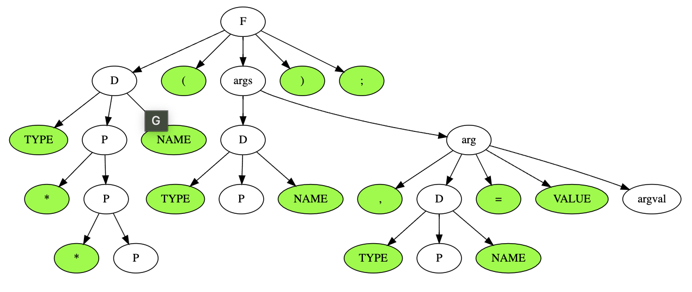

# Отчет по лабораторной № 2

**Вариант 10.** Заголовок функции в Си 

Заголовок начинается именем возвращаемого типа или словом “void”, далее 
идет имя функции, скобка, затем разделенные запятой описания аргументов. 
Переменная может быть указателем, в этом случае перед ней идет звездочка 
(возможны и указатели на указатели, и т. д.). Аргументов может быть несколько.
Используйте один терминал для всех имен переменных и имен типов.

**Пример:**
```int fib(int n);```

## Как запустить
```
// установить зависимости
npm i
nvm use

// запустить скрипт, который запишет результат в dot-raw
ts-node buildGraph.ts

// запустить тесты
npm run test
```

## Разработка грамматики
### Преобразованная грамматика
```
F -> D(args);

D -> TYPE P NAME
P -> eps | * P
args -> eps | D arg
arg -> eps | , D arg
```

## Лексический анализатор
| **Нетерминал** | **Описание**                                           |
|----------------|--------------------------------------------------------|
| **F**          | Стартовый нетерминал                                   |
| **D**          | Описание ф-ии: тип + указатели + имя                   |
| **P**          | Указатели функции / eps                                |
| **args**       | Аргументы функции / eps                                |
| **arg**        | Аргумент функции: описание + следующий аргумент / eps  |

| **Терминал**   | **Токен**     |
|----------------|---------------|
| **(**          | OPEN_BRACKET  |
| **)**          | CLOSE_BRACKET |
| **;**          | SEMICOLON     |
| **,**          | COMMA         |
| *              | POINTER       |
| **valid type** | TYPE          |
| **valid name** | NAME          |
 | $              | END           |

## FIRST и FOLLOW
| **Нетерминал** | **FIRST** | **FOLLOW** |
|----------------|-----------|------------|
| **F**          | TYPE      | $          |
| **D**          | TYPE      | ( ) ,      |
| **P**          | * eps     | NAME       |
| **args**       | type eps  | )          |
| **arg**        | , eps     | )          |

## Дерево разбора
```
signed long long int **fib(int a, int b, int **c);
```


## Тесты
- [Different types](./tests/lab2.test.ts#L3)
- [Different names](./tests/lab2.test.ts#L13)
- [Pointers](./tests/lab2.test.ts#L23)
- [Multiple arguments](./tests/lab2.test.ts#L31)

