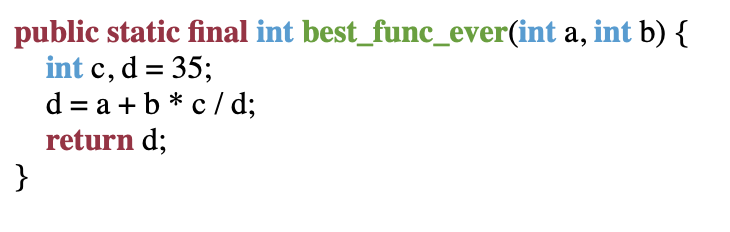

# Отчет по лабораторной № 3

**Вариант 9.** Подсветка синтаксиса в HTML

Выберите подмножества языка C++, Java или Python и напишите
конвертор программ на этом языке в HTML с подсветкой синтаксиса.

## Как запустить
```
// установить зависимости
npm i
nvm use

// в файле ./code написать пример кода на Java,
// который нужно конвертировать в HTML

// запустить скрипт, который запишет результат в index.html
node transform.js
```

## Что поддерживается?
* Объявление функции на первом уровне с различными модификаторами и аргументами
* Типы: ```int, double, float, char, String, boolean, void```
* Объявление переменных
* Арифметические операции
* Возвращение значения функции

## Пример
### До конвертации
```
public static final int best_func_ever(int a, int b) {
    int c, d = 35;
    d = a + b * c / d;
    return d;
}
```

### После - [HTML](./index.html)

